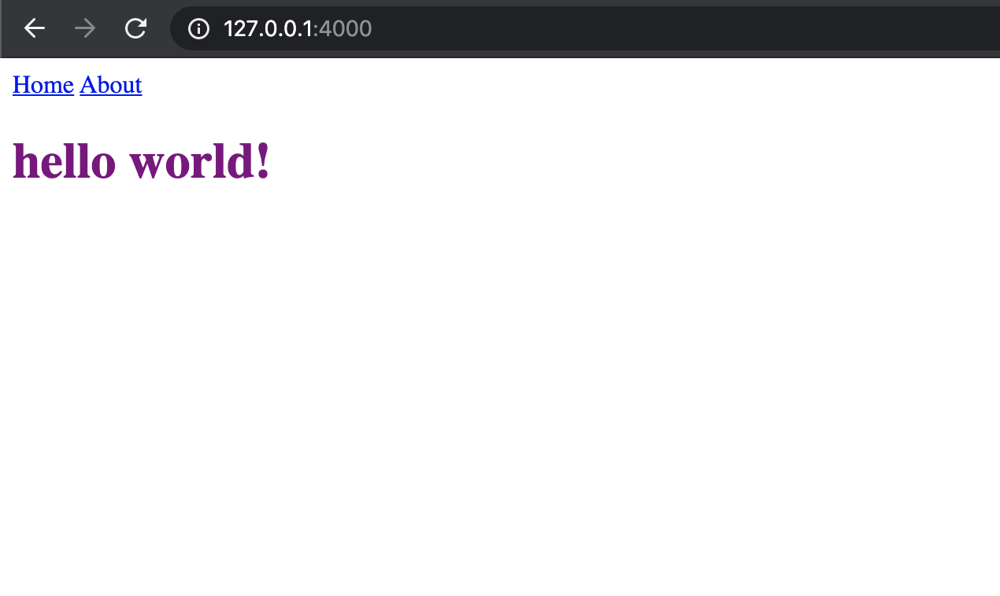
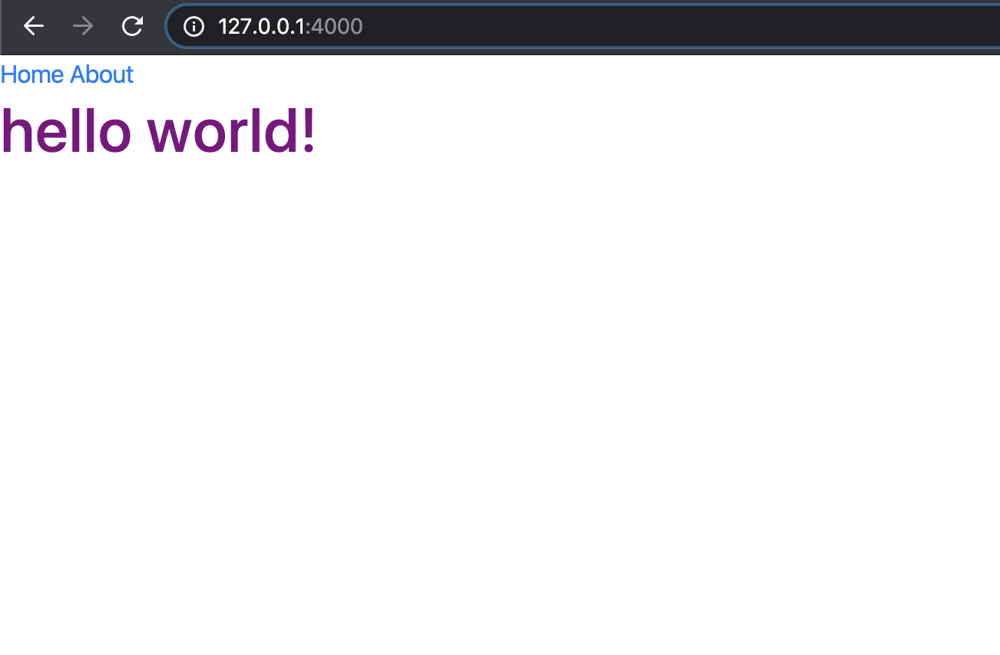
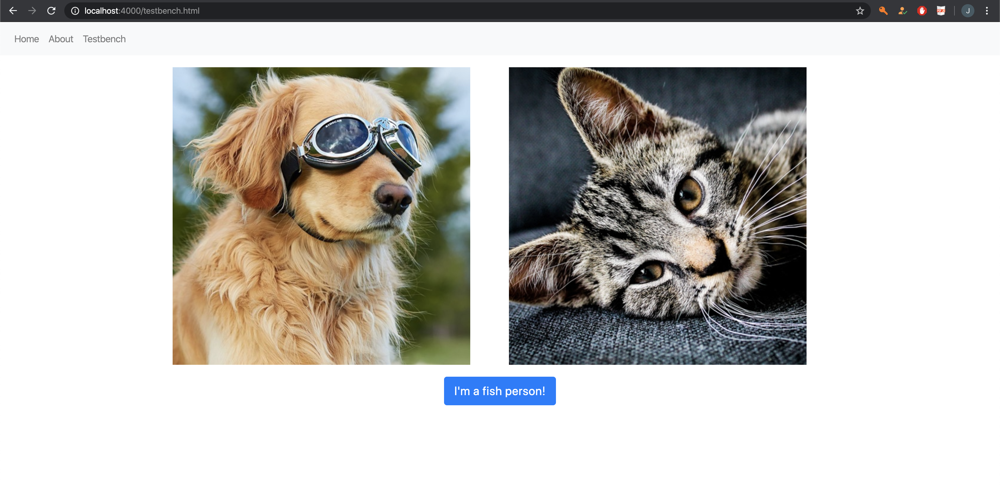
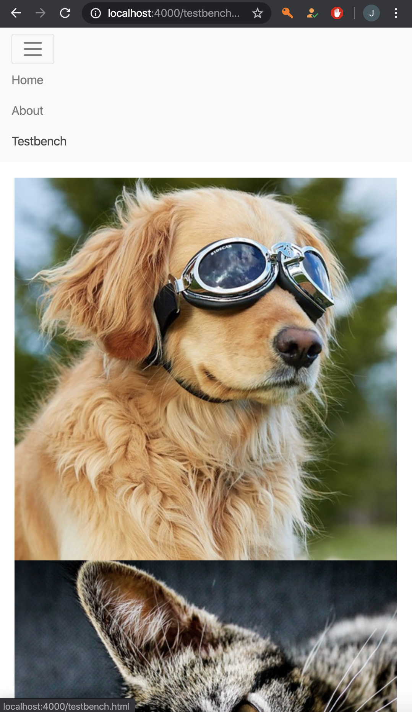

# CS52 Workshops:  Static Site Generators + CSS Frameworks

Unlike modern content management systems (CMS) like Wordpress which dynamically load content from databases and other sources when delivering a webpage to a user, static site generators take the opposite approach: all the webpages of a site are built once upon making changes, meaning that page content is not dynamically fetched each time it is requested by a user. This allows for an increase in website speed since caching is improved, in addition to better security since resources (data, images, etc.) cannot be intercepted and modified while the server builds the webpage (page is already built!).

Additionally, we can use CSS frameworks to improve the design and layout of our static site. Frameworks like Bootstrap come with predefined grid templates that allow for easy positioning of HTML elements and styling classes that enable easy enhancement of buttons, forms, tables, navigation bars, and more. As such, these CSS frameworks ease frontend and cross-platform development by allowing devs to define fewer basic styles themselves.

## Overview

This tutorial will walk you through the creation of a static website using Jekyll, a static-site generator, and then through styling that website using Bootstrap.

## Setup

Visit this link for instructions on setting up the environment.  [Jekyll Setup](https://jekyllrb.com/docs/installation/macos/)

## Step by Step

### Jekyll

Assuming you did the setup correctly, you should have Ruby > 2.4.0 installed. Why is this important? Ruby is an OOP programming language commonly used in web applications, and Jekyll happens to run on it. Ruby groups its modules by calling them "gems," which you can install.
1. Install the Jekyll and bundler gems in your project root directory (the bundler gem is just a gem management system). Run ```gem install jekyll bundler```. (If you are given `Gem::FilePermissionError`, run ```sudo gem install jekyll bundler``` instead.)
2. Create a Gemfile to list your project's dependencies by running ```bundle init```.
3. Do ```nano Gemfile``` and add ```gem "jekyll"``` to the bottom of the file. This lists Jekyll as a dependency for you project.
4. Run ```bundle``` which will install Jekyll in your project (installing the gem just made it available to your computer).
5. Do ```touch index.html && code index.html```. This will create an HTML file in your project root directory, and open it in VSCode.
6. In the file, paste the following:
```html
<!doctype html>
<html>
  <head>
    <meta charset="utf-8">
    <title>Home</title>
  </head>
  <body>
    <h1>Hello World!</h1>
  </body>
</html>
```
7. Now we will build and output our static site. Run ```jekyll build```. This will create a directory called ```_site```, where a copy of your ```index.html``` will be stored. It is this file that will be displayed as your site.
8. Now output your site with ```jekyll serve```, and open ```http://localhost:4000``` to access it! You should see an ```h1``` tag that says ```Hello World!``` Your site has been deployed locally to port ```4000```, the default for Jekyll.
9. You will now write your first line of Jekyll. Open ```index.html``` in your root directory and insert the following code at the very top of the file:
```
---
heading: Hello World!
---
```  
Now, change the text in the ```h1``` to ```{{ page.heading }}```. Now reload the page. It didn't change! That's because the syntax at the top of the page assigns heading as a variable name for the ```page```, and it contains the text ```Hello World!```. In Jekyll, double curly braces identify variables created in such a way.  
Let's test out a filter. Change the contents of the ```h1``` to ```{{ page.heading | downcase }}```, then refresh the page. You should see ```hello world!```.  
Why does this work, although it is not standard HTML5? If you enter the ```_site``` directory, it may provide some insight. The deployed site is from ```_site/index.html```, NOT the file you just modified. By running ```jekyll serve``` before, you told Jekyll to — on any change to ```index.html``` — rebuild the page in ```_site/index.html```, then redeploy it to port ```4000```. There is no "Jekyll" syntax in ```_site/index.html```, because Jekyll processes ```index.html``` into HTML5 that the browser can read. The way that Jekyll knows that you want to use its syntax is the inclusion of the "triple dash" section at the top of you ```index.html```. Pretty cool!  

10.  Now let's add some CSS. Add the following line of code to the bottom of the ```head``` section in ```index.html```:
```html
<link rel="stylesheet" href="style.css">
```
In your root directory, do ```touch style.css``` to create an empty stylesheet. Open it up and add the following style to it:
```css
h1 {
  color: purple;
}
```
If you reload your page, you should see the text change color. What if you wanted to add ten more pages to your site with the same stylesheet, but didn't want to have to link the CSS file every time?   
As a problem that can easily extend to the inclusion of many, many CSS, JS, and other ```head``` properties, there is a way to streamline this in Jekyll.  
The answer is Layouts. First, let's create our second page, not in HTML, but in Markdown.  

11. Do ```touch about.md``` in your root directory, and add the following to it (you can personalize the text):
```
# About page

This page tells you a little bit about me.
```  

To turn this Markdown file into HTML, we will need to create a layout for it. Go to the terminal in your root directory and do ```mkdir _layouts && cd _layouts && touch default.html```. These commands will create a directory fo your layouts and an empty layout.  
Paste the following content in there:  
```html
<!doctype html>
<html>
  <head>
    <meta charset="utf-8">
    <link rel="stylesheet" href="style.css">
    <title>{{ page.title }}</title>
  </head>
  <body>
    {{ content }}
  </body>
</html>
```  
Now add the following to the top of your about.md:  
```
---
layout: default
title: About
---
```  
Here, you are passing ```default``` as the layout file you want to use to create the html file for the about page, and ```About``` as the title to be used in ```page.title``` on that page.  

12. Now go to ```http://localhost:4000/about.html``` in your browser. You should see your newly created about page!  

13. Next, we will work on some basic navigation. Suppose you wanted a ```nav``` that each of your pages share. In normal HTML, you would have to write it into each page individually. Jekyll makes this process modular, allowing you to import (or rather, include) HTML from a centralized source into each of your pages.  
14. In your root directory, do ```mkdir _includes && cd _includes && touch navigation.html```. This creates the directory for HTML that will be used in multiple files, as well as the file that we will be using to store our navigation code.  
15. Paste the following into navigation.html:
```html
<nav>
  <a href="/">Home</a>
  <a href="/about.html">About</a>
</nav>
```  
You might wonder why we dont need to include the ```html``` tag anywhere in this file. That is because we are only storing a single component (the ```nav```) in this file, and it will inevitably be used in a file that does have ```html``` tags.  
In default.html (in your ```_layouts``` directory) add the following line to the top of the body:  
```

```
Then, add ```layout: default``` into the top section (three-dash area) of your index.html under the root directory.  

We just did a couple of things. First, in ```default.html``` the `````` syntax indicates logic or control-flow code. ```include``` is a special keyword that reaches into our ```_includes``` directory and searches for the parameter, ```navigation.html```. When it finds that file, it takes the code inside and inserts it where ```include``` was called, thus showing our ```nav```.  
In the index.html folder, we added the default layout in order to include our ```nav```. Technically, a lot of the code in ```index.html``` is now redundant, because we have a layout for it. However, this is inconsequential to the functioning of our website.

If you did everything correctly, your homepage will be generated by Jekyll and should look like this:



Now on to Part 2!

### Bootstrap

Congrats, you created your first website with Jekyll! 🥳🎉
Now let's give your site some pizzazz! 🎨🖌️

1. Since we already have a `default.html` file that includes the `head` we want for each page, we can easily add Bootstrap's stylesheet to all our pages. Just add the following to the `head` of `default.html`:

```html
<link rel="stylesheet" href="https://stackpath.bootstrapcdn.com/bootstrap/4.4.1/css/bootstrap.min.css" integrity="sha384-Vkoo8x4CGsO3+Hhxv8T/Q5PaXtkKtu6ug5TOeNV6gBiFeWPGFN9MuhOf23Q9Ifjh" crossorigin="anonymous">
```

2. In order to use Bootstrap's JavaScript features (which allow us to use elements like sliders and expanding menus), be sure to also add the following to the bottom of the `body` in `default.html`:

```html
<script src="https://code.jquery.com/jquery-3.4.1.slim.min.js" integrity="sha384-J6qa4849blE2+poT4WnyKhv5vZF5SrPo0iEjwBvKU7imGFAV0wwj1yYfoRSJoZ+n" crossorigin="anonymous"></script>
<script src="https://cdn.jsdelivr.net/npm/popper.js@1.16.0/dist/umd/popper.min.js" integrity="sha384-Q6E9RHvbIyZFJoft+2mJbHaEWldlvI9IOYy5n3zV9zzTtmI3UksdQRVvoxMfooAo" crossorigin="anonymous"></script>
<script src="https://stackpath.bootstrapcdn.com/bootstrap/4.4.1/js/bootstrap.min.js" integrity="sha384-wfSDF2E50Y2D1uUdj0O3uMBJnjuUD4Ih7YwaYd1iqfktj0Uod8GCExl3Og8ifwB6" crossorigin="anonymous"></script>
```

3. To make sure we properly rebuild and redisplay the updated layout with Bootstrap, go back to your terminal and kill the current `jekyll serve` process (you can just press `Ctrl` + `C` on your keyboard). Now, re-run `jekyll build` and `jekyll serve`, and return to `localhost:4000` in your browser. If you did everything correctly, your webpage should now look a bit fancier!



4. Now that we have things set up, let's play around with the Bootstrap framework a bit! To start, let's create a new webpage by creating file `testbench.html` in the project root directory. (You should add this page to `navigation.html` as well, but we trust you know how to do that!) And don't forget, we don't need to add any CSS files to the head of this page! (Remember why?)

5. Bootstrap is perhaps infamous for its incredibly easy-to-use grid layout system. Let's give it a try! In your `testbench.html` file, add the following in the `body`:

```html
<div class="container">
  <div class="row">
    <div class="col">
      <!-- some content! -->
    </div>
    <div class="col">
      <!-- some content! -->
    </div>
  </div>
</div>
```

To start using the Bootstrap grid system, you must add a `div` with class `container`. Containers are used to help lay out the content you put inside them. From there, we can create a row, which will keep content aligned horizontally (when possible). Within that row, we can create columns. The great thing about Bootstrip is that it will readjust column widths based upon the number of columns in a given row! (Bootstrap's grid system is based on flexboxes after all!)

You can read more about the basics of Bootstrap's grid system [here](https://getbootstrap.com/docs/4.1/layout/grid/).

6. We also might want to pad our container a bit. To do so, we can go to our `style.css` file and add the following:

```css
.container {
    padding: 10px;
}
```

If you do this, you may have to change the order of linked stylesheets in `default.html` so we can override Bootstrap's default `container` properties. The later a stylesheet is imported (i.e. further toward the bottom of `head`), the more stylesheets it can override. So, you might want to change your `head` ordering in `default.html` to look like this:

```html
<head>
    <meta charset="utf-8">
    <link rel="stylesheet" href="https://stackpath.bootstrapcdn.com/bootstrap/4.4.1/css/bootstrap.min.css" integrity="sha384-Vkoo8x4CGsO3+Hhxv8T/Q5PaXtkKtu6ug5TOeNV6gBiFeWPGFN9MuhOf23Q9Ifjh" crossorigin="anonymous">
    <link rel="stylesheet" href="style.css">
    <title>{{ page.title }}</title>
</head>
```

7. Let's explore another much-loved feature of Bootstrap: buttons. Bootstrap includes a wide range of button types with baked-in styles. You can check out the basic ones (and there are a lot!) [here](https://getbootstrap.com/docs/4.0/components/buttons/).

Add a button to your page using one of the pre-defined styles on Bootstrap's website. (You can even get a hyperlink that looks like a button!) If you want to center it on the page, just wrap it in Bootstrap's helpful `<div class="text-center">`.

8. Remember the CSS checkbox hack we used in Lab 1 to create a hamburger menu, and how difficult that was to get working properly? Bootstrap makes adding a hamburger menu for mobile a breeze!

Head over to the navbar resource page on Bootstrap's website [here](https://getbootstrap.com/docs/4.1/components/navbar/). Select a style you like -- Bootstrap navbars are responsive by default. There's even an option to convert existing `a` elements to navbar items without needing a list!

After choosing a style you like, go back to your `navigation.html` and edit your `nav` according to the style you selected. We get something like this with our example:

```html
<nav class="navbar navbar-expand-lg navbar-light bg-light">
    <button class="navbar-toggler" type="button" data-toggle="collapse" data-target="#navbarNavAltMarkup" aria-controls="navbarNavAltMarkup" aria-expanded="false" aria-label="Toggle navigation">
      <span class="navbar-toggler-icon"></span>
    </button>
    <div class="collapse navbar-collapse" id="navbarNavAltMarkup">
      <div class="navbar-nav">
        <a class="nav-item nav-link" href="/">Home</a>
        <a class="nav-item nav-link" href="/about.html">About</a>
        <a class="nav-item nav-link" href="/testbench.html">Testbench</a>
      </div>
    </div>
  </nav>
```

Now you have a cool looking Jekyll-generated page with great Bootstrap CSS styling (that's also responsive on mobile)! Here's the `testbench.html` page we made on desktop:



And on mobile:



## Summary / What you Learned

* [ ] generated website with jekyll
* [ ] defined default jekyll layout
* [ ] created jekyll page with markdown
* [ ] styled webpage with Bootstrap containers, buttons (+more!)

## Reflection

* [ ] How can `default.html` allow us to reduce code redundancy when building a website with Jekyll?
* [ ] Why might a dev use Bootstrap to organize the layout of a site rather than creating base CSS elements (i.e. containers, rows) themselves?

## Resources

- Jekyll: https://jekyllrb.com/resources/
- Bootstrap: https://getbootstrap.com/docs/4.4/getting-started/introduction/
